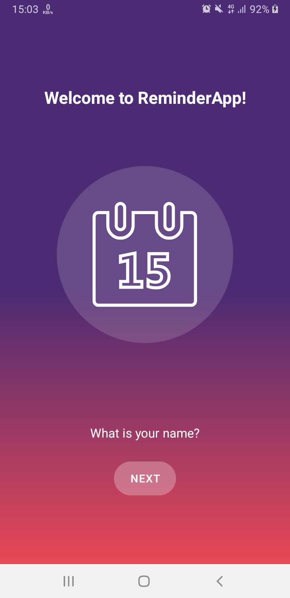
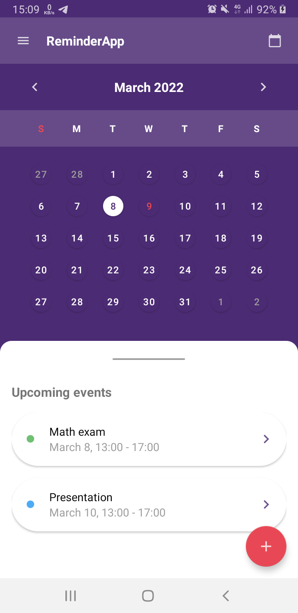
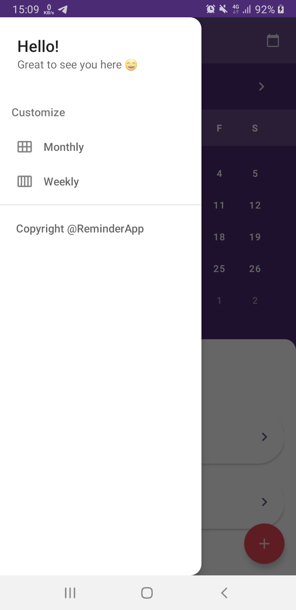
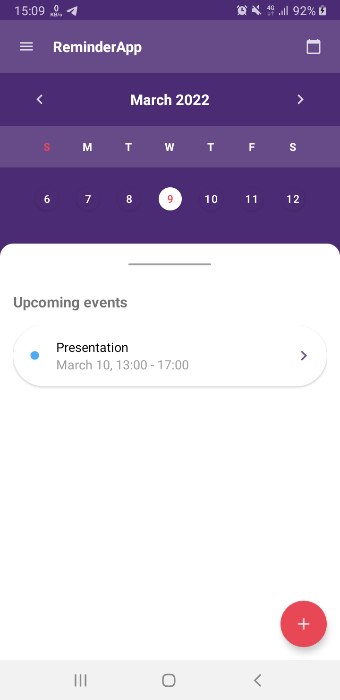
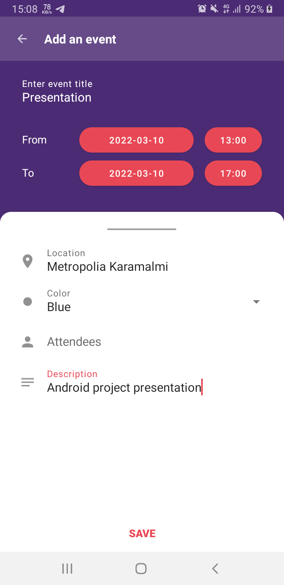
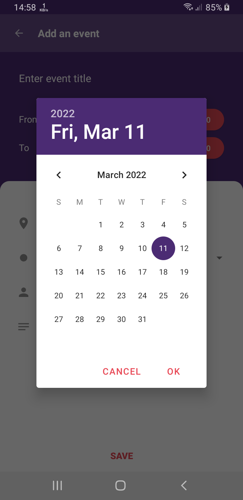
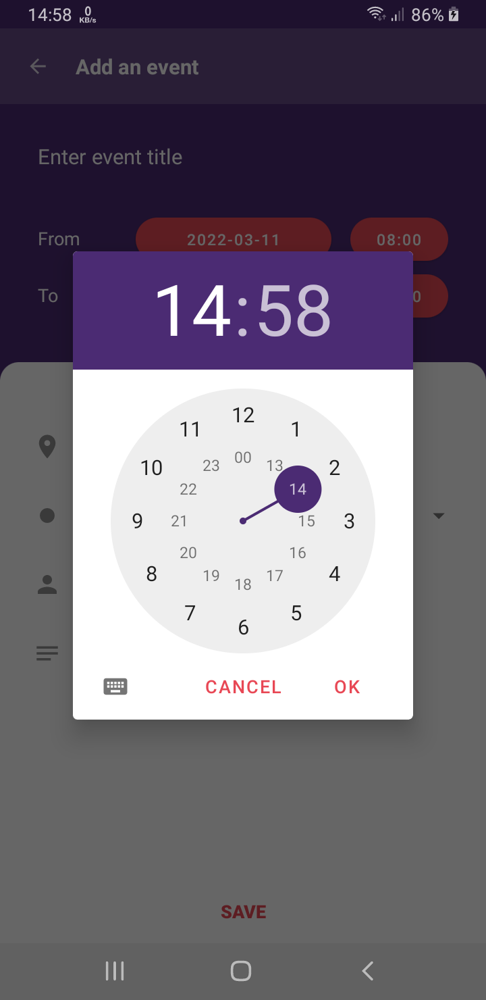

# ReminderApp

A built-int calendar application that tackles to-do list features.

## Description

ReminderApp is your Android solution for time management tool. With the custom built calendar view,
user can easily navigate to specific date and view either past or future events.

## Merits

- **Easy usage** - We tone down the amount of clicking and menu exploration to as minimal as
  possible, which in turn encompasses a nice user interface and user experience.
- **Full of features** - Events can dynamically be made or changed within a specific date and time.
  There are multiple fields to choose, such as title, location, date and time, color, etc. to fit
  one’s needs when using the application.
- **Adjustability** - Users are able to change the settings view type, to either weekly or monthly
  calendar in a smooth and user-friendly navigation. Not only does it give you clarity about how you
  spend your time, but it also allows you to plan or reference future and past events.
- **Availability** - When building this app, we give preference to making it accessible on the most
  common platform. Having a minimum SDK of A21: PI Android 5.0 Lollipop, the app will for sure cover
  the majority of Android devices, specifically 98%.

## User story and features

- **Showing events** - As a user, I want to see the activities this week, so that I can plan my
  schedule and do not miss any of the events
- **Displaying calendar** - As a businessman, I want to see a month-view calendar, so that I know
  what upcoming events I need to pay attention to.
- **Customize calendar type** - As a student, I want to have a built-in calendar application with
  customized view (week/month), so that I can view past or future events in a convenient and
  coherent way that suits my needs.
- **Create an event** - As a user, I want to create an event dynamically, so that events will
  flexibly fits my needs and change according to the time I specify.
- **Edit an event** - As a user, I want to edit an existing event, so that the data stay updated,
  and I can avoid misunderstanding when working in a team.
- **Delete an event** - As a user, I want to delete an existing event, so that I can make spaces for
  other activities or to just simply cancel that event.

## Screenshots

## Demo video

## Build instruction
1. Clone the repository
2. Open project in Android Studio
3. Connect to your Android phone using USB cable
4. Run the app
5. Or simple download [.apk](./build/ReminderApp-v0.0.1.apk)

## Test cases

### WelcomeActivity

- The calendar vector animation will run on start - PASS
- If there is no username saved in SharedPreferences, and EditText with Button will be visible -
  PASS
- If there is username saved in SharedPreferences, a new Intent to MainActivity will start after 2.5
  seconds - PASS
- Username can be changed - MISSING

### MainActivity

- Calendar shows up either in weekly or monthly type, based on SharedPreferences value - PASS
- Calendar displays current date as today by default - PASS
- Left and right navigation button works well for both calendar view type - PASS
- Navigation drawer can be opened either by top left icon or simply swiping right - PASS
- Current date is set to today if top right icon is clicked - PASS
- Upcoming events layout is full screen if swipe up - PASS
- Upcoming events show events that has begin date or end date more or equal to current date set in
  calendar - PASS
- Event list shows correct status color - PASS
- Event list shows begin date, time. If the end date is equal to begin date, end time will be shown - PASS
- When clicking one event, DetailActivity will be called and eventId will be passed - PASS
- FloatActionButton stays at the bottom - PASS
- FloatActionButton will start DetailActivity when clicked - PASS
- onBackPressed, the application will be closed instead of going back to WelcomeActivity - PASS
- Notification will be shown some time before event starts - MISSING

### DetailActivity

- The title changes based on previous action, either to add new event or edit an event - PASS
- Clicking button select date shows up DatePickerDialog - PASS
- Clicking button select time shows up TimePickerDialog - PASS
- Checking if begin date and begin time is equal or less than end time - MISSING
- Only title field is required. If click on button save with an empty title, show toast - PASS
- If the request is to add an event, all fields are empty except date, time is set to today and
  color is set to purple - PASS
- If the request is to edit an event, all fields are set to events' values - PASS
- If the request is to edit an event, delete button is visible - PASS
- Delete button onClick will delete the current event, and go back to MainActivity - PASS
- When deleting, an alert will show up to ask for user's certainty - MISSING

### Building APK
In most cases, the .apk file was installed successfully in the majority of phones. However, there were error in building the app from assembleRelease, so we had to switch to assembleDebug to produce the .apk file.
  
The application was installed in these following Android phones:

- Pixel 2 (Emulator) - PASS
- Samsung Galaxy J8 - PASS
- Ulefone Armor X5 - PASS
- OnePlus 7 - FAILED

## Others

- [Javadoc](https://users.metropolia.fi/~datp/reminder_app/)
- [UML diagram](./screenshots/ReminderApp-UML-diagram.png)

## Contributors

1. Dat Pham (Daniel)
2. Tran Cong Minh
3. Dhakeswor Nyaupane

## References

- SVG Repo n.d., Calendar SVG Vector, viewed 01 March 2022, <https://www.svgrepo.com/svg/1042/calendar>.
- Android Developers n.d., Data Binding Library, Android Developers, viewed 27 February 2022, <https://developer.android.com/topic/libraries/data-binding>.
- Android Developers n.d., Create dynamic lists with RecyclerView , Android Developers, viewed 27 February 2022, <https://developer.android.com/guide/topics/ui/layout/recyclerview>.
- Android Developers n.d., Handler, Android Developers, viewed 27 February 2022, <https://developer.android.com/reference/android/os/Handler>.
- Android Developers n.d., DatePicker, Android Developers, viewed 03 March 2022, <https://developer.android.com/reference/android/widget/DatePicker>.
- Android Developers n.d., TimePicker, Android Developers, viewed 02 March 2022, <https://developer.android.com/reference/android/widget/TimePicker>.
- Android Developers n.d., CollapsingToolbarLayout, Android Developers, viewed 02 March 2022, <https://developer.android.com/reference/com/google/android/material/appbar/CollapsingToolbarLayout>.
- Android Developers n.d., AppBarLayout, Android Developers, viewed 28 February 2022, <https://developer.android.com/reference/com/google/android/material/appbar/AppBarLayout>.
- Android Developers n.d., DrawerLayout, Android Developers, viewed 29 February 2022, <https://developer.android.com/reference/androidx/drawerlayout/widget/DrawerLayout>.
- Android Developers n.d., CoordinatorLayout, Android Developers, viewed 27 February 2022, <https://developer.android.com/reference/androidx/coordinatorlayout/widget/CoordinatorLayout>.
- Ausderau, P, Tauriainen, J 2022, ‘ListView and Singleton’, PowerPoint presentation, viewed 01 March 2022, <https://docs.google.com/presentation/d/1zISNUtQ9waKoC0cXzXoMLK9eAGX4zaLPYfkYW26hpME/edit#slide=id.p>.
- ivory_kitten 2019, ‘Android uses RecycleView to create a Custom Calendar’, Programming VIP, viewed 01 March 2022, <https://programming.vip/docs/android-uses-recycleview-to-create-a-custom-calendar.html>.
- Cao, G, Garg, S 2012, ‘Get date from datepicker using dialogfragment’, Stack Overflow, viewed 04 March 2022, <https://stackoverflow.com/questions/11527051/get-date-from-datepicker-using-dialogfragment>.
- Suragch 2017, 'How to make gradient background in android', Stack Overflow, viewed 01 March 2022, <https://stackoverflow.com/questions/13929877/how-to-make-gradient-background-in-android>.
